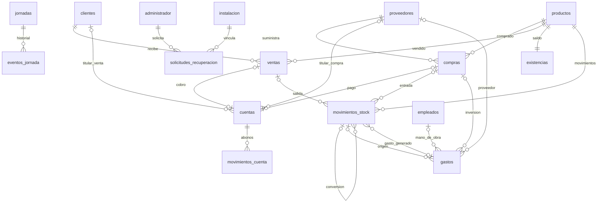

# Base de datos de RuizCacao Manager

## Funcionamiento y primer inicio

La aplicación trabaja sin internet, en una computadora Windows. React se comunica por IPC con Electron Main; solo Main accede a PostgreSQL. El cliente no configura host, puerto, base ni contraseña de PostgreSQL.

Si ya existe `postgres.enc` en los datos de la aplicación, se conserva esa conexión y se migra su esquema. No se reemplaza por una base vacía. En una instalación nueva, se prepara una instancia propia con el motor incluido en el instalador, autenticación SCRAM y escucha exclusiva en `127.0.0.1`. No se modifica el servicio PostgreSQL ni los clusters preexistentes.

La instancia propia utiliza `ruizcacao_manager`, usuario `ruizcacao_app` y el primer puerto disponible entre 55432 y 55442. Su rol es propietario de esta base, sin superusuario, sin creación de roles y sin creación de bases. La contraseña técnica aleatoria se protege con Windows `safeStorage`. El administrador del negocio tiene una contraseña diferente, almacenada como hash scrypt en PostgreSQL.

Los datos de una instalación nueva quedan en `%APPDATA%\RuizCacao Manager\postgres\data`, separados del ejecutable y del código. No se borran ni se reinicializan durante una actualización. Un cambio de versión mayor de PostgreSQL se detiene para requerir una actualización técnica; no se intenta abrir archivos de otra versión.

El cliente ve Crear usuario, con el campo vacío y validaciones por campo. Internamente se conserva el único rol administrador. Después utiliza Iniciar sesión. La recuperación offline usa una solicitud única y una autorización Ed25519 firmada por el desarrollador. La aplicación contiene exclusivamente la clave pública; la privada permanece fuera del proyecto. Sin clave pública de producción la recuperación queda deshabilitada. El antiguo recovery_hash queda deprecado y nullable; ya no se utiliza. Cinco intentos fallidos bloquean el acceso durante 15 minutos.

## Comprobar desde pgAdmin

Desde una terminal normal de Windows, ubicada en `electron-app`:

```powershell
npm run db:pgadmin
```

Este comando técnico usa la misma conexión que la aplicación. Si la app está cerrada, aplica las migraciones pendientes; si está abierta, no toma su sesión ni interrumpe su jornada. Para aplicar una actualización, cerrar primero la app normalmente. En una instalación nueva inicia el motor propio y lo deja disponible para la inspección. No crea un administrador del negocio ni registros de ejemplo.

El comando imprime host, puerto, base, usuario y la ruta de `servidor-pgadmin.json`. Nunca imprime la contraseña. Importar ese archivo en **Tools → Import/Export Servers** de pgAdmin. Como alternativa, registrar un servidor usando los datos impresos y añadir el parámetro de conexión `passfile` apuntando al archivo `pgpass.conf` indicado por el comando. Esto requiere pgAdmin de escritorio bajo el mismo usuario de Windows.

La exportación queda en `%APPDATA%\RuizCacao Manager\postgres\administracion`. Esa carpeta tiene permisos limitados al usuario de Windows y SYSTEM. `pgpass.conf` contiene una contraseña técnica: no incluirlo en Git, capturas ni informes. Es una exportación administrativa opcional; el cliente no necesita generarla.

Expandir **Databases → ruizcacao_manager → Schemas → ruizcacao → Tables**. Si la conexión anterior usa otro nombre de base, seleccionar el nombre impreso. Abrir `database/verificacion.sql` en Query Tool para revisar versión, columnas, relaciones, inventario y caja. El ERD de pgAdmin puede generarse sobre el esquema para mostrar las claves foráneas reales.

Referencias oficiales: [importación de servidores de pgAdmin](https://www.pgadmin.org/docs/pgadmin4/9.17/import_export_servers.html) y [archivo de contraseñas de PostgreSQL](https://www.postgresql.org/docs/18/libpq-pgpass.html).

## Estructura relacional

Las entidades comerciales usan columnas SQL explícitas, con claves primarias, relaciones y restricciones. No se guardan como documentos JSON. `numeric` almacena importes y cantidades; `date` representa la fecha comercial y `timestamptz` las marcas temporales. Las operaciones usan la zona `America/Guayaquil`.

| Tablas | Responsabilidad |
|---|---|
| `clientes`, `proveedores`, `empleados` | Identificación, contacto, estado activo y fecha de registro. Desactivación lógica. |
| `productos` | Catálogo: cacao en baba, cacao seco y maracuyá. |
| `compras`, `ventas` | Producto, cantidad, precio, impuesto, importe, contraparte y pago inicial. |
| `cuentas` | Obligación por compra, cobro por venta o cuenta manual; contraparte y estado. |
| `movimientos_cuenta` | Abonos, ajustes, medio de pago y comprobantes. |
| `movimientos_stock` | Compras, ventas, conversiones, ajustes y mermas; factores y pesaje. |
| `existencias` | Saldo por producto y costo promedio, actualizado con sus movimientos en la misma transacción. |
| `gastos` | Gastos manuales y referencia de inversión de compras; relación con empleado o proveedor. |
| `jornadas`, `eventos_jornada` | Estado por fecha y auditoría de aperturas, cierres y reaperturas. Solo una jornada activa. |
| `administrador` | Nombre de acceso, hash scrypt y bloqueo por intentos fallidos. |
| `instalacion`, `solicitudes_recuperacion`, `control_recuperacion` | Identidad de instalación, solicitudes de un solo uso y control de abuso separado del login. |
| `respaldos` | Metadatos y SHA-256; los archivos custom permanecen fuera de PostgreSQL. |
| `sesiones` | Detección de cierres normales o interrupciones para AutoRecover. |
| `notificaciones` | Avisos y estado leído persistente. |
| `configuracion` | Último factor de conversión. |
| `migraciones` | Versiones aplicadas. |
| `operaciones`, `auditoria` | Identificador único del comando, reintentos y trazabilidad. |

Se conservan nombres históricos y ciertos importes calculados para reproducir comprobantes y compatibilidad con las reglas actuales. Esas instantáneas están identificadas; no sustituyen a las relaciones. El saldo vigente de la cuenta se deriva de total menos monto aplicado. Los documentos JSON restantes están limitados a respuestas técnicas de idempotencia y evidencia de auditoría.



Las fechas comerciales no son claves foráneas de jornada: el modelo actual permite fechas históricas y operaciones de inventario fuera de una jornada. Los eventos de apertura y cierre sí están relacionados con la jornada correspondiente.

## Transacciones y migraciones

Cada comando vuelve a leer el estado confirmado, aplica las reglas del dominio y escribe los cambios dentro de una sola transacción. Una compra confirma juntos compra, cuenta, pago inicial, gasto de inversión, inventario y auditoría. Las ventas, abonos y conversiones siguen el mismo principio. El renderer solo actualiza la pantalla después del COMMIT. Las claves de operación evitan duplicar una compra por un reintento.

La versión 1 corresponde al esquema provisional. La versión 2 transforma sus documentos en columnas, conserva sus registros y crea `existencias`. DDL, traslado y registro de versión forman una transacción: si una fila incumple una regla, todo se revierte. No se corrigen ni eliminan registros automáticamente para forzar una migración.

La versión 3 agrega recuperación asimétrica, metadatos de respaldos y destinos/claves de notificación: 24 tablas en total. Antes de migrar una base existente se verifica un respaldo custom; si falla, no se inicia el cambio de esquema. La migración y el registro de versión se confirman en una transacción.

Los SQL de `database/001-base.sql`, `database/002-relacional.sql` y `database/003-seguridad-respaldos.sql` y `database/004-interrupciones-umbrales.sql` documentan las migraciones. `npm run db:sql` exporta la versión nueva y verifica que las migraciones ya exportadas permanezcan idénticas. La aplicación inserta además un installation_id aleatorio con parámetros SQL al aplicar la versión 3. No deben ejecutarse manualmente de manera aislada sobre la base de uso; el arranque controla el orden y la versión. La creación del esquema no introduce datos comerciales de ejemplo.

## Jornadas, recuperación y caja

Abrir una jornada no requiere contraseña. Finalizar una jornada requiere confirmación visual, pero no contraseña. Reabrir la jornada del día actual sí requiere la contraseña del usuario autenticado. Una jornada que sigue activa al cambiar de día puede cerrarse, pero después no se reabre si ya corresponde a una fecha anterior.

Al cerrar sesión o confirmar el cierre de la aplicación se cierra la jornada. En un corte de energía no es posible ejecutar código de cierre: al iniciar de nuevo, AutoRecover detecta la sesión inconclusa, conserva las operaciones confirmadas, marca la jornada como interrumpida y registra un aviso. Las operaciones quedan bloqueadas hasta validar contraseña: la de hoy puede recuperarse; una anterior debe finalizarse antes de abrir otra. Salir o reiniciar sin resolverla no la convierte en un cierre normal. Esto no recupera formularios sin guardar ni sustituye una copia de seguridad frente a pérdida de disco.

`v_saldos` muestra las obligaciones vigentes. `v_flujo_caja` incluye cobros efectivos de ventas, pagos efectivos de compras y gastos manuales. Una compra pendiente no produce un egreso hasta pagarse. Los gastos automáticos de compra no vuelven a sumarse. El saldo de caja no equivale a utilidad contable: la aplicación mantiene el criterio de efectivo solicitado.

## Distribución offline

`npm run build:win` prepara `vendor/postgresql` desde una distribución oficial instalada y la incluye en los recursos del instalador. Se copian binarios, librerías, archivos de soporte y licencias; nunca el directorio `data` del PostgreSQL instalado. `RUIZCACAO_POSTGRES_DIST` permite elegir una distribución específica antes de empaquetar. No se requiere descargar PostgreSQL al iniciar la app instalada.

Para actualizaciones de la app debe conservarse la misma versión mayor del motor mientras no exista un procedimiento de actualización de PostgreSQL. La política inicial conserva 14 respaldos automáticos íntegros; no elimina manuales ni copias previas a migración/restauración. Antes de producción queda pendiente la prueba del instalador en Windows limpia descrita en WINDOWS_LIMPIA.md.

## Archivos principales y validación

- `src/main/database/postgres-local.ts`: preparación, arranque, parada y exportación administrativa.
- `src/main/database/conexion.ts`: selección de conexión existente o instancia propia.
- `src/main/database/schema.ts`, `relacional.ts`: migraciones, columnas y adaptación de DTO.
- `src/main/database/base.ts`: transacciones, persistencia, autenticación, jornadas y AutoRecover.
- `src/main/database/seguridad.ts`, `validacion.ts`, `ipc.ts`: hashes, validaciones y frontera IPC.
- `src/shared/dominio.ts`: reglas comerciales compartidas; Main autoriza y persiste.
- `src/renderer/src/components/Acceso.tsx`: acceso del cliente, sin configuración de PostgreSQL.
- `scripts/pgadmin.cjs`: administración desde una terminal del desarrollador.

Validaciones realizadas en bases aisladas: 19 escenarios de negocio y seguridad; migración con datos y rollback ante una fila inválida; arranque, cierre y reinicio del motor propio; comprobación de rol sin superusuario y exportación de pgAdmin. TypeScript pasa. Se compilaron Main, Preload y Renderer directamente con Vite. El comando `electron-vite build` sigue bloqueado en el entorno restringido del asistente por acceso a carpetas superiores; no se considera validado el instalador.

La conexión real cifrada de esta computadora debe abrirse desde la sesión normal de Windows. El entorno del asistente no pudo utilizar `safeStorage`; no se debilitó el cifrado ni se reemplazó la conexión guardada. El usuario ejecutó la herramienta desde Windows y confirmó: **versión 4, 24 tablas, 0 columnas de documentos comerciales**, en `ruizcacao_manager`, servidor `127.0.0.1:5432`. Esta instalación conserva su conexión previa; no utiliza el puerto del motor propio previsto para instalaciones nuevas.

## Cierre técnico versión 3

Consultar [CIERRE_PERSISTENCIA.md](CIERRE_PERSISTENCIA.md) para recuperación Ed25519, respaldo/restauración, errores seguros, PDF y resultados de validación de esta fase. El apartado de validación anterior describe la fase 2; no implica que la base de uso ya esté en versión 3.

Para el informe desde pgAdmin: conectar mediante db:pgadmin, seleccionar el esquema ruizcacao, usar la opción de generar ERD disponible en el menú contextual del esquema/base y guardar/exportar el diagrama desde ERD Tool. No crear tablas manualmente. Si la versión de pgAdmin ofrece Generate ERD solo sobre la base, incluir únicamente el esquema ruizcacao. Ejecutar primero database/verificacion.sql para comprobar versión, tablas y claves foráneas reales. Evitar capturas de administrador, solicitudes completas, auditoría sensible o passfile.

La versión actual preparada es **4**, con 24 tablas. La migración 004 agrega el estado interrumpida, la exclusión de jornadas activas/interrumpidas simultáneas y productos.umbral_stock opcional. Los umbrales se configuran desde Stock, sin valores de negocio predefinidos. Ver RELEASE_CANDIDATE.md para los resultados finales y bloqueantes.
